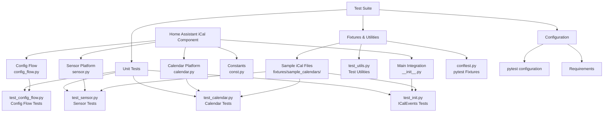
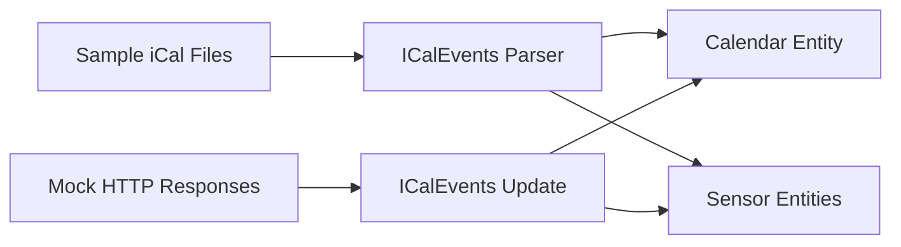
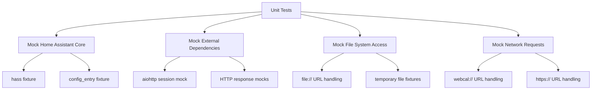
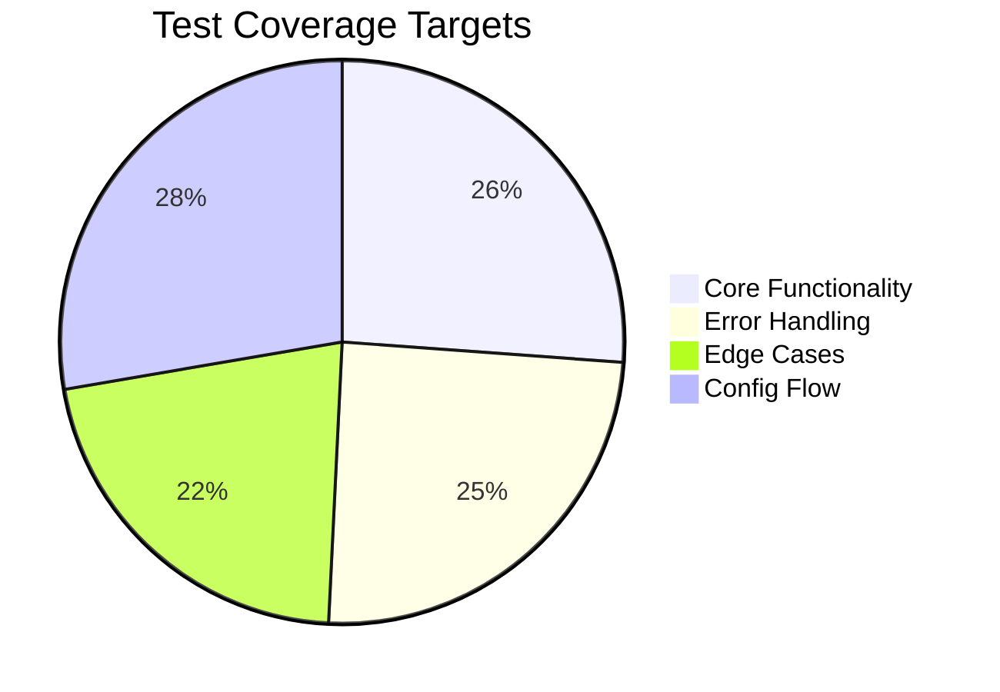
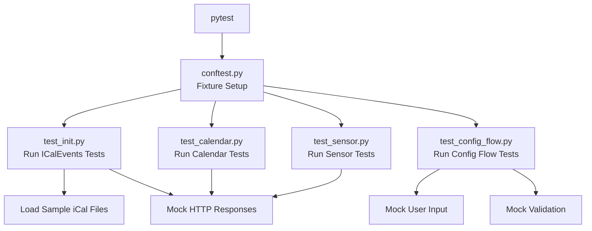

# Testing Architecture for iCal Home Assistant Component

## Overview
This document provides a visual representation of the testing architecture for the iCal Home Assistant custom component.

## Test Architecture Diagram

## Test Data Flow

## Test Isolation Strategy

## Coverage Goals

## Integration Points

The tests will validate the following integration points:

1. **iCal Parsing Integration**
   - Direct parsing of iCal content
   - Recurring event expansion
   - Timezone conversion

2. **Home Assistant Integration**
   - Entity creation and registration
   - State updates
   - Attribute population

3. **Network Integration**
   - HTTP request handling
   - File system access
   - Error condition handling

4. **Configuration Integration**
   - User input validation
   - Config entry creation
   - Setup flow completion

## Test Execution Flow

This architecture ensures comprehensive testing of all component functionality while maintaining isolation for reliable, repeatable tests.
